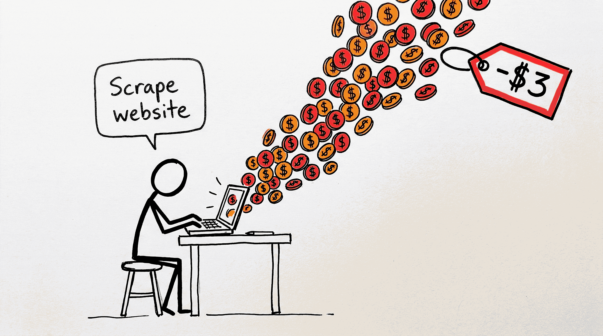
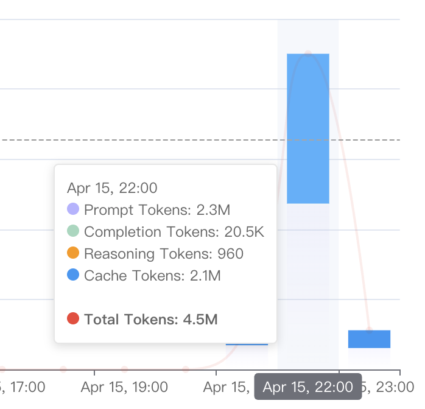

# webclaw3

[English](./README.md) | **中文**

> 让 AI Agent 的浏览器任务学会一次——以后永远免费跑。

每次让 AI Agent 操作浏览器，你都在付 token 费，而且结果时灵时不灵：今天能跑通，啥也没改、明天就失败。webclaw3 把一次成功的探索固化成可复用的 **skill**——每天都要跑的任务，不再每天都花钱。



## 先算一笔账

一次"去这个网站看看"的任务就要消耗百万级 tokens。下图是一次浏览器任务的真实 API 账单：



- Prompt 2.3M × $3/MTok = $6.90 | Completion 20.5K × $15/MTok = $0.31 | Cache 2.1M × $0.30/MTok = $0.63
- 考虑缓存命中浮动：Sonnet **单次 ≈ $2 ~ $3+**
- Opus（$5/$25）同样任务 **$5 ~ $8+**；复杂任务多轮探索，轻松突破 $10

每天跑一次，一个月就是 **$90+**——同样的步骤，每次从头重新思考。你有 3 个麻烦事：

- **每天都在烧钱。** 同一个网站、同样的操作，AI 每次都重新消耗百万级 tokens，像雇了一个每天失忆的员工。
- **执行不稳定。** AI 浏览网页天然不稳定——同一个任务，这次成功，下次可能因为页面加载顺序不同就失败。
- **需要人盯着。** 你花了钱，还得盯着它跑，随时准备重跑。本该自动化的事情，反而更累了。

## 工作原理

思路就一条：**探索一次，提炼成 skill，以后免费反复跑。** 整条链路都在你自己的机器上、在你已经在用的 Agent（Claude Code、workbuddy、qoderwork）里完成。

**① 探索——把"自己要什么"搞清楚。** 说个大概方向就行，Agent 用本 skill 驱动你的真实浏览器去跑。需求是试出来的：看着真实结果调范围、调筛选、调字段，直到你拍板——**就是这个**。

**② 提炼——一句话变成 skill。** 说"帮我提炼"。Agent 和你确认最终需求后，**webclaw3** 用你本地 Chrome 的登录态重新探索网站、生成 skill、换参数验证，后台跑几十分钟——全在你自己机器上完成。

**③ 日常跑——确定性、几乎免费。** 生成的 skill 是纯脚本，**零 token 或极少 token**、毫秒级返回、每次结果一致。随时跑，也可以配成定时任务。

**④ 修复——也免费。** 网站改版导致 skill 失效时，把报错甩给本地 Agent，它直接在本地修好，不收费。

| | 用 AI 直接跑 | 用 skill |
|---|---|---|
| 单次简单任务 | $2 ~ $3 | $0 |
| 单次复杂任务 | $5 ~ $10+ | $0 |
| 每天跑一次，一个月 | $60 ~ $300 | $0 |
| 稳定性 | 时灵时不灵 | 确定性执行，每次一致 |

## 快速上手

你全程不用离开 Agent 的对话框——Claude Code、workbuddy、qoderwork 都可以。下面所有步骤都是你**说的话**，命令由 Agent 去跑。
> 支持所有 Agent 产品：[Claude Code](docs/claude-code.zh-CN.md) · [workbuddy](docs/workbuddy.zh-CN.md) · [qoderwork](docs/qoderwork.zh-CN.md)

**1. 一次性准备。** 两件小事：

- **装 Chrome 扩展**（要你自己点几下，一次就好）：从 [wc3-chrome](https://github.com/fatmind/wc3-chrome) 下载，`chrome://extensions` 开「开发者模式」→「加载已解压的扩展程序」→ 选 `extension/` 目录。
- **到 [webclaw3.com](https://webclaw3.com) 登录拿 Access Key**：它是你的账号钥匙——生成 skill 扣次数、拉取**站点经验库**（别人探索过的站点结构，让你的生成更快更稳）都靠它。顺便提一句：回传你探索过的站点结构会积累积分，可兑换生成额度，越早越划算——详见[定价](#定价)。

然后对你的 Agent 说一句：

```
帮我安装 webclaw3（https://github.com/fatmind/wc3-ranger），装好检查一下环境
```

Agent 会把本仓库装进你的 skills 目录、拉起本地服务，并引导你完成基本配置（填入刚拿的 Access Key等）。提一句——webclaw3 用的是**你自己的浏览器和登录态**，账号密码不经过任何人。

**2. 探索。** 说个大概方向，让 Agent 真实去跑：

```
帮我看看 SkillHub（https://skillhub.cn/）的下载热榜都有什么
```

边看边调（`每条加上下载量和评分` / `只要前 10 条`），直到就是你要的，因为你的复杂需求，也没法一下子说清楚。直到你满意后 —— 才值得提炼，以后不用再花钱、花时间重来。

**3. 提炼。** 说：

```
把刚才这个提炼成 skill，我以后要每天跑
```

webclaw3 会自动理好你的需求，你确认后交给 webclaw3 在本地生成。生成在后台跑几十分钟，Agent 自动轮询进展、自动验证，完成后自动安装。

**4. 日常跑：**

```
/skillhub-trending（举例） 跑一下今天的榜单
```

或配成定时任务（`每天早上 8 点自动跑 skillhub-trending`）。本地执行，快、稳、零 token 或极少 token。

**5. 出问题：** 也是一句话：

```
skillhub-trending 跑失败了，webclaw3 帮我修一下
```

webclaw3 在本地直接修。

## 定价

- **生成 skill**：每个账号免费 10 次额度，失败不扣
- **日常运行**：免费——skill 在你本地跑
- **失效修复**：免费——本地直接修
- **回传站点经验赚积分**：生成时回传的是站点网页结构，**不包含任何用户信息**。回传积累积分，可兑换生成额度；未来还有贡献度分成——越早开始越好，因为站点是有限的，先传先占

细则见 [webclaw3.com](https://webclaw3.com)。

## 了解更多

- 各 Agent 使用说明：[Claude Code](docs/claude-code.zh-CN.md) · [workbuddy](docs/workbuddy.zh-CN.md) · [qoderwork](docs/qoderwork.zh-CN.md)
- 这个 skill 本身怎么工作：[docs/wc3-ranger-intro.zh-CN.md](docs/wc3-ranger-intro.zh-CN.md)


## License

MIT
